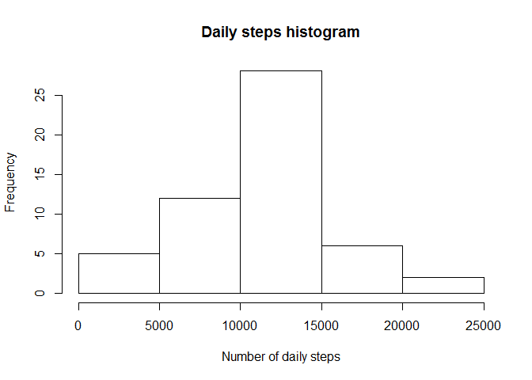
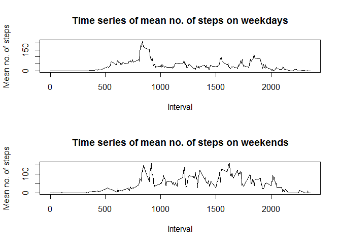

# Reproducible Research: Peer Assessment 1


## Loading and preprocessing the data

```r
temp <- tempfile()
download.file("https://d396qusza40orc.cloudfront.net/repdata%2Fdata%2Factivity.zip", temp)
#data <- read.csv("activity.csv")
data <- read.csv(unz(temp, "activity.csv"))
unlink(temp)
data$date <- as.Date(data$date, format="%Y-%m-%d")
```

## What is mean total number of steps taken per day?

```r
daily.steps <- tapply(data$steps, data$date, FUN = sum)
hist(daily.steps, main = "Daily steps histogram", xlab = "Number of daily steps")
```

<!-- -->

```r
mean.daily.steps <- mean(daily.steps, na.rm = TRUE)
median.daily.steps <- median(daily.steps, na.rm = TRUE)
cat("Mean Steps per Day is",mean.daily.steps, ".  Median is", median.daily.steps, ".")
```

```
## Mean Steps per Day is 10766.19 .  Median is 10765 .
```

```r
#cat("Median Steps per Day =",median.daily.steps)
```

## What is the average daily activity pattern?

```r
daily.activity.pattern <- tapply(data$steps, data$interval, FUN = mean, na.rm = TRUE)
plot(rownames(daily.activity.pattern), daily.activity.pattern, type = "l", ylab = "Mean no. of steps", xlab = "Interval no.")
```

<!-- -->

## Imputing missing values

```r
data2 <- data
data2 <- within(data2, steps <- ifelse(is.na(steps), yes = daily.activity.pattern[((interval)/5)+1], no = steps))
daily.steps2 <- tapply(data$steps, data$date, FUN = sum)
hist(daily.steps2, xlab = "Interval")
```

<!-- -->

```r
mean.daily.steps2 <- mean(daily.steps2, na.rm = TRUE)
median.daily.steps2 <- median(daily.steps2, na.rm = TRUE)

cat("Mean adjusted mean steps per Day is",mean.daily.steps2, ".  The previous is ", mean.daily.steps, ".")
```

```
## Mean adjusted mean steps per Day is 10766.19 .  The previous is  10766.19 .
```

```r
cat("Mean adjusted mean steps per Day is",median.daily.steps2, ".  The previous is ", median.daily.steps, ".")
```

```
## Mean adjusted mean steps per Day is 10765 .  The previous is  10765 .
```


## Are there differences in activity patterns between weekdays and weekends?


```r
library(plyr)
```

```
## Warning: package 'plyr' was built under R version 3.2.5
```

```r
data2$weekday <- as.factor(weekdays(data2$date))
levels(data2$weekday) <- mapvalues(levels(data2$weekday), from = c("Monday", "Tuesday", "Wednesday", "Thursday", "Friday", "Saturday", "Sunday"), to = c("weekday", "weekday", "weekday", "weekday", "weekday", "weekend","weekend"))
x <- data2$weekday == "weekday"
y <- data2$weekday == "weekend"


daily.activity.pattern1 <- tapply(data2$steps[x], data2$interval[x], FUN = mean, na.rm = TRUE)

daily.activity.pattern2 <- tapply(data2$steps[y], data2$interval[y], FUN = mean, na.rm = TRUE)
par(mfrow = c(2, 1))
plot(rownames(daily.activity.pattern1), daily.activity.pattern1, type = "l", ylab = "Mean no. of steps", xlab = "Interval", main = "Time series of mean no. of steps on weekdays")
plot(rownames(daily.activity.pattern2), daily.activity.pattern2, type = "l", ylab = "Mean no. of steps", xlab = "Interval", main = "Time series of mean no. of steps on weekends")
```

<!-- -->
